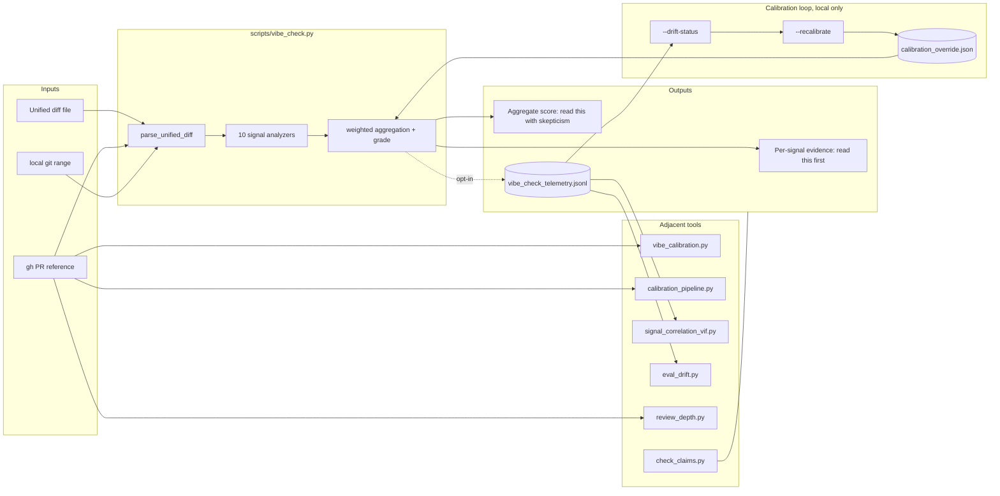

# vibe-check

A reviewer evidence surfacer for PRs that may contain LLM-generated code. Python standard library only. No trained model. No outbound network except `gh` when you use PR mode.

## What this is

`vibe-check` is a small CLI plus a skill bundle for reviewers. You feed it a unified diff (or a PR reference) and it runs ten regex and AST heuristics. The output is per-signal evidence: hallucinated API calls, bare `except:` blocks, AI-tool markers in commit messages. Comment-phrasing boilerplate too. Edge-case nesting depth. The full list is in the signals table below.

**It isn't a detector.** Recent benchmarks (CLAIMS C-005, C-008) report detectors of this class as below practical usability under distribution shift. The skill's value is prompting reviewer attention to specific patterns. The aggregate score is a weighted convenience number; treat it as ordinal at best.

We found that out the hard way. The first version of this tool reported its own source as 36% AI (grade C). Two of its signals had bugs. One of its weights cited a research table that didn't exist. Both fixed in v0.2.0. The tool now reports its own source at 24% (grade B), and regression tests cover every bug that was inflating the old number. See `CHANGELOG.md` for the postmortem.

## Why bother

A few empirical findings from the [evidence ledger](references/EVIDENCE_LEDGER.md) and the quote-level [claims ledger](references/CLAIMS.md):

- **40% of Copilot programs were vulnerable** across 89 CWE-aligned scenarios, 1,689 programs total ([Pearce et al., IEEE S&P 2022](https://arxiv.org/abs/2108.09293), CLAIMS C-001).
- In real GitHub projects, **29.5% of Copilot Python and 24.2% of JavaScript snippets** had security weaknesses across 43 CWE categories. Eight of those CWEs are in the 2023 CWE Top-25 ([Fu et al., 2023](https://arxiv.org/abs/2310.02059), CLAIMS C-002).
- AI-assisted users wrote **significantly less secure code** *and* were **more likely to believe their code was secure** ([Perry et al., CCS 2023](https://arxiv.org/abs/2211.03622), CLAIMS C-003). That second clause is the part that should worry you.
- Existing detectors **"perform poorly and lack sufficient generalizability to be practically deployed"**, including ML-on-AST detectors which top out at F1 ≈ 82.55 in-distribution ([Wang et al., ICSE 2025](https://arxiv.org/abs/2411.04299), CLAIMS C-005).
- **AICD Bench (2026)** ran 2M examples across 77 models and 9 languages and found detector performance **"far below practical usability"** under distribution shift and adversarial code ([arXiv:2602.02079](https://arxiv.org/abs/2602.02079), CLAIMS C-008).

So `vibe-check` does not solve detection. It surfaces known fingerprints so a reviewer can ask better follow-up questions. Is this `os.path.mkdirs` real? Does that catch swallow real errors? Did the author actually understand this code?

## Install and first run

Requirements: Python 3.10+. Optional: [GitHub CLI](https://cli.github.com/) for `--pr` mode.

```bash
git clone <this repo>
cd vibe-check
python scripts/vibe_check.py --diff tests/fixtures/minimal.diff --format markdown
```

Three typical calls:

```bash
python scripts/vibe_check.py --pr 123                                   # PR in cwd's repo
python scripts/vibe_check.py --repo-path . --base main --head feature-branch
python scripts/vibe_check.py --diff /path/to/changes.diff --format json

# Honest mode: show evidence only, suppress aggregate score and grade.
python scripts/vibe_check.py --diff changes.diff --no-aggregate
```

Exit zero always. This is a reviewer aid, not a CI gate. Output is Markdown by default, or JSON with `--format json`. Nothing gets uploaded. Telemetry, when you enable it, is a local JSONL file.

## The ten signals

Each signal returns a score in `[0, 1]`. The overall score is a **weighted convenience number**, not a calibrated probability. Weights below are **SPECULATIVE PRIORS** (see [`references/CALIBRATION_NOTES.md`](references/CALIBRATION_NOTES.md)). Run `scripts/calibration_pipeline.py` on a labeled corpus from your own codebase before quoting any of these numbers.

| # | Signal | Default weight | What it looks for | CLAIMS map |
|---|--------|---------------:|-------------------|------------|
| 1 | Comment-to-code ratio | 0.18 | Universally predictive but model-magnitude-variable | C-007 |
| 2 | Docstring consistency | 0.15 | Most-or-all functions documented (paraphrase setting) | C-006 |
| 3 | Naming uniformity | 0.13 | Capped at 0.4 in {Python, Go} because PEP 8 / gofmt enforces style | C-006 |
| 4 | Error handling | 0.12 | Tiered. Bare `except:` is strong, broad `except Exception` is soft | P-003 (pending) |
| 5 | Declarative bias | 0.10 | Assignments + returns vs control flow; ignores `==`/`!=`/`<=`/`>=` | C-007 |
| 6 | Function length CV | 0.08 | **Diff-only approximation**, confidence capped at 0.4 | C-007 + K-002 |
| 7 | Comment phrasing | 0.08 | Boilerplate "Initialize the X" patterns | author catalog |
| 8 | Hallucinated APIs | 0.06 | 12 regex patterns; **strongest single signal when it fires** | author catalog |
| 9 | Edge case depth | 0.05 | Indent-based nesting plus null/guard-check density (Python AST-style) | author heuristic |
| 10 | Commit metadata | 0.05 | "Co-authored-by: Claude/Copilot/GPT" etc. | pattern catalog |

## How it works

1. Parse the unified diff into hunks. Track added lines per file and a rough language guess.
2. For each file, run the ten signal analyzers. Each returns `{score, weight, confidence, evidence, patterns, explanation}`.
3. Compute a confidence-weighted average. That's the aggregate score. The per-signal evidence is what's actually useful.
4. Assign a letter grade. With `--no-aggregate`, the tool skips this step and shows only evidence.
5. Optionally log one JSON line per run to `$VIBE_CHECK_TELEMETRY_DIR/vibe_check_telemetry.jsonl`.
6. `--drift-status` reads telemetry, splits 60/40, and emits a drift decision (default metric is `mean_shift`).
7. `--recalibrate` does a quantile shift on recent telemetry and writes `calibration_override.json`. Weights stay bounded to `[0.02, 0.30]` and renormalize to sum 1.0.

### Drift metrics: three options, none calibrated on this workload

- `mean_shift` (default). Per-signal z-shift with a 1.5σ threshold. The default because we've seen it behave sensibly in-repo, not because we know it's optimal.
- `psi`. [Population Stability Index](https://www.fiddler.ai/blog/measuring-data-drift-population-stability-index) with industry-convention thresholds 0.10 and 0.25 (CLAIMS C-012, **secondary** source, not from an RCT). PSI is a per-distribution statistic. This implementation averages PSI across signals, which is **non-standard** and not validated anywhere we could find. Calibrate before you rely on the threshold.
- `sinkhorn`. Entropy-regularized 1D OT on binned scores. **Experimental.** The default 0.22 is arbitrary. Use `scripts/eval_drift.py` to fit it on your data.

`VIBE_CHECK_DRIFT_PERSISTENCE_M` and `_N` require M of the last N raw trips before the status flips to `TRIGGER_*`. Lone trips show up as `WATCH`.

### Scope notes and limitations

- **Not a quality judgment.** A high score doesn't mean bad code.
- **FP/FN rules of thumb** are author estimates around 15-25% and 20-30% respectively. They aren't validated on labeled data in this repo. Mileage will vary.
- **Go and Rust narrow the stylometric gap.** gofmt enforces a single style; Rust idioms cluster tightly. Both languages make the human-vs-LLM comparison harder.
- **Signals correlate.** Treat the weighted sum as roughly four latent factors (documentation, defensive coding, uniformity, naming), not ten independent votes. Ensemble conformal CIs would assume independence, and this implementation isn't ensemble conformal anyway.
- **Adversarial robustness is limited.** A determined author can suppress most signals by editing AI output. It may be an arms race, but the goal is to weed out lazy AI-generated, unvetted code. Someone taking the time to sneak around this skill is someone putting in more intention and effort anyway. Hallucinated APIs and commit metadata are the hardest to prompt-game; the rest are not.

## Tools in this repo

| Tool | Purpose |
|------|---------|
| `scripts/vibe_check.py` | The scorer. One diff in, JSON or Markdown out. |
| `scripts/vibe_calibration.py` | Per-repo stratified baselines from `gh`. |
| `scripts/calibration_pipeline.py` | Label-grounded Phase 1–4 pipeline; see [`docs/ARCHITECTURE.md`](docs/ARCHITECTURE.md). |
| `scripts/signal_correlation_vif.py` | Offline Pearson + exact VIF on telemetry. Writes suggestions; never edits live weights. |
| `scripts/eval_drift.py` | Threshold-grid replay for the three drift metrics. |
| `scripts/review_depth.py` | `gh pr view` to audit-priority JSON. See [`docs/AUDIT_PRIORITY_ETHICS.md`](docs/AUDIT_PRIORITY_ETHICS.md). |
| `scripts/check_claims.py` | Two-mode citation lint: reachability AND non-empty primary-source quotes. |
| `scripts/vibe_detect/` | Older PR-batch scanner used by incident workflows. Output gitignored. |

## Architecture



## Calibration pipeline at a glance

```bash
python scripts/calibration_pipeline.py --repo YOUR_ORG/YOUR_REPO
```

Default output goes to `outputs/calibration_<UTC timestamp>/`. Pin a path with `--out-dir`. Phase 1 pulls PRs labeled `vibe-coded`, `copilot`, `llm`, and similar. Phase 3 samples merged PRs that carry none of those labels. The run will flag itself as low-confidence if it finds fewer than ten labeled PRs.

> **Important.** `outputs/vibe-baseline-calibration/` in this repo was a **5-PR demo**, not a baseline. The summary file says so explicitly. Don't treat its numbers as ground truth.

## Opt-in environment flags

All off by default.

| Variable | Default | Effect |
|----------|---------|--------|
| `VIBE_CHECK_TELEMETRY_DIR` | unset | Append-only JSONL of signals, scores, residual margin per run |
| `VIBE_CHECK_DRIFT_GLOBAL_METRIC` | `mean_shift` | Pick `mean_shift`, `psi`, or `sinkhorn` |
| `VIBE_CHECK_DRIFT_PSI_THRESHOLD` | `0.25` | PSI cutoff (Field B; CLAIMS C-012) |
| `VIBE_CHECK_DRIFT_SINKHORN_THRESHOLD` | `0.22` | Experimental; calibrate with `eval_drift.py` |
| `VIBE_CHECK_DRIFT_PERSISTENCE_M` / `_N` | `1` / `1` | Require M of last N raw trips before exposing `TRIGGER_*` |
| `VIBE_CHECK_HALLUCINATION_EXTRAS` | unset | JSON file with extra regex patterns; [example here](examples/hallucination_extras.example.json) |
| `VIBE_CHECK_ENABLE_MODEL_EVOLUTION` | unset | Required to run `--model-evolution` (otherwise returns `EXPERIMENTAL_DISABLED`); see CALIBRATION_NOTES K-004 |

## Contributing

Start with [`docs/ARCHITECTURE.md`](docs/ARCHITECTURE.md). Then:

1. Run the test suite. Both must pass before any PR.
   ```bash
   python -m unittest tests/test_analyzers.py -v
   bash tests/test_skill_smoke.sh
   ```
2. Run `python scripts/check_claims.py --strict-quotes` before committing docs that mention a paper, an arXiv ID, or a numeric claim. Every claim must resolve to a row in [`references/CLAIMS.md`](references/CLAIMS.md) with a non-empty quote, or be tagged `[unverified]` in the prose.
3. Stdlib only. No new pip dependencies. CI verifies that no `requirements.txt`, `setup.py`, or `pyproject.toml` is present.
4. Follow the Feathers and Fowler patterns. New behavior goes behind an environment flag or in a separate script. Characterization test comes first. Rollback should take under an hour. See [`docs/CHANGE_PLAN_20260417_psi_persistence_claims.md`](docs/CHANGE_PLAN_20260417_psi_persistence_claims.md) for the template.

## Ethics guardrails

`scripts/review_depth.py`, and any future artifact-priority signals, **must not** be used as an individual performance metric. Framing, retention, and the kill switch are in [`docs/AUDIT_PRIORITY_ETHICS.md`](docs/AUDIT_PRIORITY_ETHICS.md). We mean this. The tool will mislead you about a person's work if you let it.

## Security

See [`SECURITY.md`](SECURITY.md). Short version:

- No credentials, tokens, or private keys live in the working tree or git history.
- No inbound network listener. Outbound traffic only happens through `gh` when you use PR-based modes.
- Telemetry is local JSONL. Secrets that appear in a diff never round-trip through this tool. Only derived metrics do.
- Internal scan artifacts stay in `.gitignore`.

## Related portfolio repos

- **`weijia-89/palamedes`**: rigorous-research skill plus multi-agent synthesis prompt. Composes with this repo on AI-generated code: claim-verify the research output first, then run any patch through `vibe-check` before merge.
- **`weijia-89/playwrighter`**: production Playwright pattern library. Pair with `vibe-check` for QA work: patterns shape the test, scanner flags AI-tells in the diff.
- **`weijia-89/trainer.skill`**: routing skill for an 8-specialist agent toolkit. Its `form-check` specialist references this repo's signals during code-review and adversarial-review modes.

---

## Changelog

See [`CHANGELOG.md`](CHANGELOG.md).
