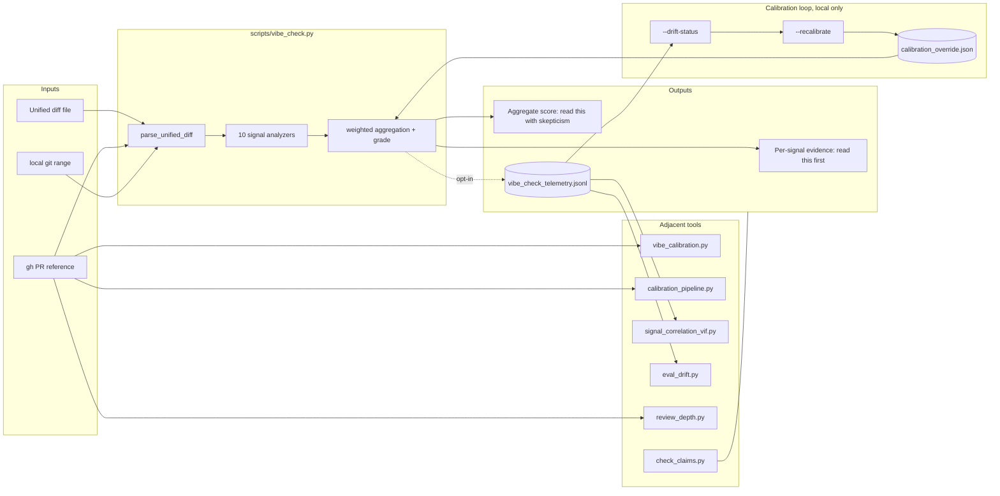

# vibe-check

I built vibe-check as a reviewer aid that flags LLM-generated patterns in a PR diff. It runs ten regex and AST heuristics in Python stdlib alone, with no trained model and no outbound network except `gh` for PR mode.

vibe-check is not a detector. Recent benchmarks (AICD Bench 2026, Wang et al. ICSE 2025) report detectors of this class as below practical usability under distribution shift. It shortens the distance between "this diff is fine" and "let me check the import on line 18 against the real registry."

## Quick start

Requirements: Python 3.10+. Optional: [GitHub CLI](https://cli.github.com/) for `--pr` mode.

```bash
git clone https://github.com/weijia-89/vibe-check && cd vibe-check
python scripts/vibe_check.py --diff tests/fixtures/minimal.diff --format markdown
```

`--no-aggregate` returns per-signal evidence without the score. The three modes you'll actually use:

```bash
python scripts/vibe_check.py --pr 123                                   # PR in cwd's repo
python scripts/vibe_check.py --repo-path . --base main --head feature-branch
python scripts/vibe_check.py --diff /path/to/changes.diff --format json
```

Exit code is always zero, because this is a reviewer aid and not a CI gate. Nothing gets uploaded. Telemetry, when you turn it on, is a local JSONL file.

## Why I built it this way

The first version of vibe-check reported its own source as 36% AI and gave it grade C. That was wrong in three ways. The edge-case-depth signal incremented monotonically through any sequence of indent openers and reported nesting depth of 198 on a 1874-line file. The declarative-bias signal counted `==` and `!=` comparisons as assignments, so `if foo == bar` was reading as the AI-typical assignment-heavy pattern when it was the opposite. And one of the weights cited a research table in CLAIMS that I had never written, because I built an early version of the ledger in a rush and made up a citation.

Fixing those three things dropped the tool's self-score to 24% (grade B), and I encoded each bug class as a named regression test in `tests/test_analyzers.py` as T1 through T7 so the next revision can't quietly re-introduce them. One of those tests, `test_self_dogfood_realistic_depth`, runs the depth analyzer against vibe-check's own source on every CI run and asserts depth stays under 12. After the fabricated citation I wrote `scripts/check_claims.py --strict-quotes`, which now fails any PR that adds a numeric claim to the docs without a verbatim primary-source quote in `references/CLAIMS.md`.

I'm telling you this because if a tool whose job is to catch AI-style fingerprints is grading itself with a fabricated citation, you should not trust the tool until it has a structural reason not to lie to you. The ledger, the strict-quotes gate, and the named regression tests are that reason.

## What the research shows

Empirical work since 2022 has been consistent on two points and uncertain on a third. Pearce and colleagues (IEEE S&P 2022) found 40% of Copilot programs vulnerable across 89 CWE-aligned scenarios over 1,689 programs (CLAIMS C-001), and a year later Fu and colleagues found 29.5% of Copilot Python snippets and 24.2% of JavaScript snippets carrying security weaknesses across 43 CWE categories in real GitHub projects, eight of which sit in the 2023 CWE Top-25 (CLAIMS C-002). The finding I keep coming back to is Perry and colleagues (CCS 2023), who found AI-assisted users wrote significantly less secure code *and* were more likely to believe their code was secure (CLAIMS C-003). That miscalibration between confidence and correctness is the gap a confident reviewer waves through, which is the gap vibe-check tries to surface.

The uncertain point is whether anyone can reliably detect AI-generated code at scale. Wang and colleagues (ICSE 2025) reviewed existing detectors and concluded they "perform poorly and lack sufficient generalizability to be practically deployed," with ML-on-AST detectors topping out at F1 around 82.55 in-distribution (CLAIMS C-005). AICD Bench (2026) ran 2M examples across 77 models and 9 languages and reported detector performance "far below practical usability" under distribution shift and adversarial code (CLAIMS C-008). That is why I do not call this tool a detector.

## The ten signals

Each signal returns a score in `[0, 1]`. The overall score is a **weighted convenience number**, not a calibrated probability. Weights below are **SPECULATIVE PRIORS** (see [`references/CALIBRATION_NOTES.md`](references/CALIBRATION_NOTES.md)). Run `scripts/calibration_pipeline.py` on a labeled corpus from your own codebase before quoting any of these numbers.

| # | Signal | Default weight | What it looks for | CLAIMS map |
|---|--------|---------------:|-------------------|------------|
| 1 | Comment-to-code ratio | 0.18 | Universally predictive but model-magnitude-variable | C-007 |
| 2 | Docstring consistency | 0.15 | Most-or-all functions documented (paraphrase setting) | C-006 |
| 3 | Naming uniformity | 0.13 | Capped at 0.4 in {Python, Go} because PEP 8 / gofmt enforces style | C-006 |
| 4 | Error handling | 0.12 | Tiered. Bare `except:` is strong, broad `except Exception` is soft | P-003 (pending) |
| 5 | Declarative bias | 0.10 | Assignments + returns vs control flow; ignores `==`/`!=`/`<=`/`>=` | C-007 |
| 6 | Function length CV | 0.08 | **Diff-only approximation**, confidence capped at 0.4 | C-007 + K-002 |
| 7 | Comment phrasing | 0.08 | Boilerplate "Initialize the X" patterns | author catalog |
| 8 | Hallucinated APIs | 0.06 | 12 regex patterns; **strongest single signal when it fires** | author catalog |
| 9 | Edge case depth | 0.05 | Indent-based nesting plus null/guard-check density (Python AST-style) | author heuristic |
| 10 | Commit metadata | 0.05 | "Co-authored-by: Claude/Copilot/GPT" etc. | pattern catalog |

## How it works

1. Parse the unified diff into hunks. Track added lines per file and a rough language guess.
2. For each file, run the ten signal analyzers. Each returns `{score, weight, confidence, evidence, patterns, explanation}`.
3. Compute a confidence-weighted average. That's the aggregate score. The per-signal evidence is what's actually useful.
4. Assign a letter grade. With `--no-aggregate`, the tool skips this step and shows only evidence.
5. Optionally log one JSON line per run to `$VIBE_CHECK_TELEMETRY_DIR/vibe_check_telemetry.jsonl`.
6. `--drift-status` reads telemetry, splits 60/40, and emits a drift decision (default metric is `mean_shift`).
7. `--recalibrate` does a quantile shift on recent telemetry and writes `calibration_override.json`. Weights stay bounded to `[0.02, 0.30]` and renormalize to sum 1.0.

### Drift metrics

I shipped three drift options because none of them is the obvious right answer for this workload. `mean_shift` is the default and uses a 1.5σ per-signal z-shift cutoff, which I picked because the behavior has matched my intuition on in-repo telemetry rather than because I know it is optimal. `psi` is [Population Stability Index](https://www.fiddler.ai/blog/measuring-data-drift-population-stability-index) with the industry-convention 0.10 and 0.25 thresholds (CLAIMS C-012, secondary source, not from an RCT); PSI is per-distribution by definition, and this implementation averages PSI across signals, which is non-standard and is not validated anywhere I could find. `sinkhorn` is experimental, uses entropy-regularized 1D OT on binned scores, and ships with a default threshold of 0.22 that I guessed. Use `scripts/eval_drift.py` to fit any of them on your own data before quoting a cutoff.

`VIBE_CHECK_DRIFT_PERSISTENCE_M` and `_N` require M of the last N raw trips before the status flips to `TRIGGER_*`. Lone trips show up as `WATCH`.

### Scope notes and limitations

- **Not a quality judgment.** A high score doesn't mean bad code.
- **FP/FN rules of thumb** are author estimates around 15-25% and 20-30% respectively. They aren't validated on labeled data in this repo. Mileage will vary.
- **Go and Rust narrow the stylometric gap.** gofmt enforces a single style; Rust idioms cluster tightly. Both languages make the human-vs-LLM comparison harder.
- **Signals correlate.** Treat the weighted sum as roughly four latent factors (documentation, defensive coding, uniformity, naming), not ten independent votes. Ensemble conformal CIs would assume independence, and this implementation isn't ensemble conformal anyway.
- **Adversarial robustness is limited.** A determined author can suppress most signals by editing AI output. It may be an arms race, but the goal is to weed out lazy AI-generated, unvetted code. Someone taking the time to sneak around this skill is someone putting in more intention and effort anyway. Hallucinated APIs and commit metadata are the hardest to prompt-game; the rest are not.

## Tools in this repo

| Tool | Purpose |
|------|---------|
| `scripts/vibe_check.py` | The scorer. One diff in, JSON or Markdown out. |
| `scripts/vibe_calibration.py` | Per-repo stratified baselines from `gh`. |
| `scripts/calibration_pipeline.py` | Label-grounded Phase 1–4 pipeline; see [`docs/ARCHITECTURE.md`](docs/ARCHITECTURE.md). |
| `scripts/signal_correlation_vif.py` | Offline Pearson + exact VIF on telemetry. Writes suggestions; never edits live weights. |
| `scripts/eval_drift.py` | Threshold-grid replay for the three drift metrics. |
| `scripts/review_depth.py` | `gh pr view` to audit-priority JSON. See [`docs/AUDIT_PRIORITY_ETHICS.md`](docs/AUDIT_PRIORITY_ETHICS.md). |
| `scripts/check_claims.py` | Two-mode citation lint: reachability AND non-empty primary-source quotes. |
| `scripts/vibe_detect/` | Older PR-batch scanner used by incident workflows. Output gitignored. |

## Architecture



## Calibration pipeline at a glance

```bash
python scripts/calibration_pipeline.py --repo YOUR_ORG/YOUR_REPO
```

Default output goes to `outputs/calibration_<UTC timestamp>/`. Pin a path with `--out-dir`. Phase 1 pulls PRs labeled `vibe-coded`, `copilot`, `llm`, and similar. Phase 3 samples merged PRs that carry none of those labels. The run will flag itself as low-confidence if it finds fewer than ten labeled PRs.

The `outputs/vibe-baseline-calibration/` directory in this repo was a 5-PR demo and not a baseline. The summary file says so explicitly. Don't quote its numbers as ground truth.

## Opt-in environment flags

All off by default.

| Variable | Default | Effect |
|----------|---------|--------|
| `VIBE_CHECK_TELEMETRY_DIR` | unset | Append-only JSONL of signals, scores, residual margin per run |
| `VIBE_CHECK_DRIFT_GLOBAL_METRIC` | `mean_shift` | Pick `mean_shift`, `psi`, or `sinkhorn` |
| `VIBE_CHECK_DRIFT_PSI_THRESHOLD` | `0.25` | PSI cutoff (Field B; CLAIMS C-012) |
| `VIBE_CHECK_DRIFT_SINKHORN_THRESHOLD` | `0.22` | Experimental; calibrate with `eval_drift.py` |
| `VIBE_CHECK_DRIFT_PERSISTENCE_M` / `_N` | `1` / `1` | Require M of last N raw trips before exposing `TRIGGER_*` |
| `VIBE_CHECK_HALLUCINATION_EXTRAS` | unset | JSON file with extra regex patterns; [example here](examples/hallucination_extras.example.json) |
| `VIBE_CHECK_ENABLE_MODEL_EVOLUTION` | unset | Required to run `--model-evolution` (otherwise returns `EXPERIMENTAL_DISABLED`); see CALIBRATION_NOTES K-004 |

## Contributing

Start with [`docs/ARCHITECTURE.md`](docs/ARCHITECTURE.md). Then:

1. Run the test suite. Both must pass before any PR.
   ```bash
   python -m unittest tests/test_analyzers.py -v
   bash tests/test_skill_smoke.sh
   ```
2. Run `python scripts/check_claims.py --strict-quotes` before committing docs that mention a paper, an arXiv ID, or a numeric claim. Every claim must resolve to a row in [`references/CLAIMS.md`](references/CLAIMS.md) with a non-empty quote, or be tagged `[unverified]` in the prose.
3. Stdlib only. No new pip dependencies. CI verifies that no `requirements.txt`, `setup.py`, or `pyproject.toml` is present.
4. Follow the Feathers and Fowler patterns. New behavior goes behind an environment flag or in a separate script. Characterization test comes first. Rollback should take under an hour. See [`docs/CHANGE_PLAN_20260417_psi_persistence_claims.md`](docs/CHANGE_PLAN_20260417_psi_persistence_claims.md) for the template.

## Ethics guardrails

I built `scripts/review_depth.py` and any future artifact-priority signals to surface review-attention asymmetry, and they must not be used as an individual performance metric. The framing, the retention policy, and the kill switch all live in [`docs/AUDIT_PRIORITY_ETHICS.md`](docs/AUDIT_PRIORITY_ETHICS.md). I mean that. The tool will mislead you about a person's work if you let it.

## Security

See [`SECURITY.md`](SECURITY.md). Short version:

- No credentials, tokens, or private keys live in the working tree or git history.
- No inbound network listener. Outbound traffic only happens through `gh` when you use PR-based modes.
- Telemetry is local JSONL. Secrets that appear in a diff never round-trip through this tool. Only derived metrics do.
- Internal scan artifacts stay in `.gitignore`.

## Related portfolio repos

The three that pair most directly with vibe-check on QA-for-AI work:

- **[`weijia-89/oncology-rag-lab`](https://github.com/weijia-89/oncology-rag-lab)**: an offline RAG evaluation lab with DeepEval, Phoenix tracing, drift detection, and a regression-gated CI. Same baseline-pinned, audit-trail-honest discipline applied to LLM evaluation instead of code review.
- **[`weijia-89/playwrighter`](https://github.com/weijia-89/playwrighter)**: production Playwright pattern library plus a working test-quality scorer. Pair vibe-check with playwrighter on QA work: patterns shape the test, scanner flags AI-tells in the diff.
- **[`weijia-89/northwind-qa`](https://github.com/weijia-89/northwind-qa)**: 50-test Playwright suite that uses playwrighter's patterns end-to-end and ships seven real bug reports against the SUT, with regression-test guards.

Two more in the same ethos:

- **[`weijia-89/palamedes`](https://github.com/weijia-89/palamedes)**: rigorous-research skill plus a multi-agent synthesis prompt. Same evidence discipline shape applied to research output rather than code.
- **[`weijia-89/wcag-auditor`](https://github.com/weijia-89/wcag-auditor)**: accessibility audit tool that replaced its LLM-based fix engine with deterministic per-rule templates in v0.3, because the templates were already accurate enough and the LLM call was not adding signal.

---

## Changelog

See [`CHANGELOG.md`](CHANGELOG.md).
